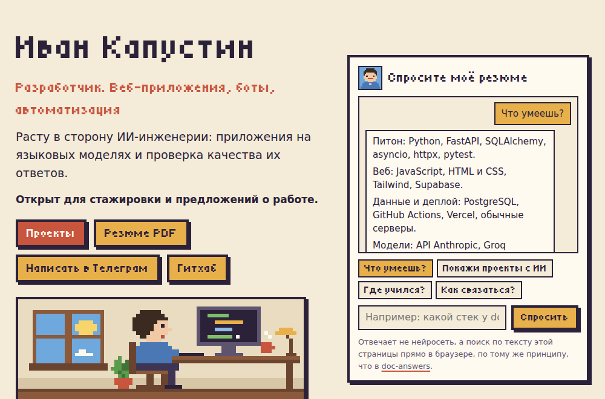

# maarshir.github.io

[](https://github.com/maarshir/maarshir.github.io/actions/workflows/tests.yml)

[](https://maarshir.github.io)

Сайт-резюме в пиксельном стиле: [maarshir.github.io](https://maarshir.github.io).

На первом экране пиксельный персонаж печатает за компьютером, а за окном утро, день, вечер или ночь по часам гостя. Рядом окно «Спросите моё резюме»: можно нажать готовый вопрос или написать свой. Отвечает не нейросеть, а поиск по данным сайта прямо в браузере, как в [doc-answers](https://github.com/maarshir/doc-answers), и под ответом видно, где он нашёлся. Ниже карточки проектов в виде картриджей.

Для любопытных внизу есть пасхалка: пиксельный городок, где проекты стоят домами и по ним можно погулять персонажем ([прямая ссылка](https://maarshir.github.io/#town)).

## Как запустить у себя

```bash
git clone https://github.com/maarshir/maarshir.github.io
cd maarshir.github.io
npm test     # проверки данных, сборки и ссылок
npm start    # сайт на http://localhost:8000
```

Нужен Node.js 20 или новее, зависимостей для сайта нет. Все тексты лежат в `data/profile.json` и `data/projects.json`, тексты резюме PDF в `data/resume.json`. После правки `npm run build` собирает страницу, резюме и превью, а на Гитхабе это делается само после каждого пуша, вместе со снимком экрана для этого README.

## Как устроено

- **Обычный HTML, CSS и JavaScript без фреймворков.** Страница со шрифтом весит несколько десятков килобайт и открывается сразу.
- **Страница собирается заранее.** HTML готов ещё до открытия, поэтому сайт виден без JavaScript, его читают поисковики и превью ссылок в мессенджерах.
- **Один источник правды.** Главная, картинка превью и окна в городке берутся из тех же двух файлов данных и не могут разойтись. Резюме PDF берёт оттуда имя и контакты, а свои тексты из `data/resume.json`.

<details>
<summary>Файлы проекта</summary>

```text
data/profile.json    кто я, обо мне, образование, работа, стек, контакты
data/resume.json     тексты резюме PDF: заголовок, проекты, опыт, стек, образование
data/projects.json   проекты: раздел (main или personal), строка для карточки, описание, стек, код и здание в городке (null, если кода или здания нет)
js/render.mjs        проверка данных и сборка HTML главной страницы
js/avatar.mjs        пиксельный аватар 16×16 строками букв и перевод его в SVG
js/ask.mjs           «Спросите моё резюме»: основы слов, BM25 по разделам, сборка ответа из данных
js/chat.mjs          окно чата в браузере: кнопки, поле, печать ответа
js/typewriter.mjs    печатная машинка, общая для чата и окон городка
js/scene.mjs         пиксельная сцена первого экрана в SVG и время суток по часу гостя
js/walker.mjs        персонаж у края: место от доли прокрутки, направление, кадр шага
js/live.mjs          связка сцены, появления карточек и персонажа у края с браузером
js/town/map.mjs      карта городка: тайлы, здания, двери, точка появления
js/town/physics.mjs  движение и столкновения у ног персонажа
js/town/path.mjs     поиск пути по клику (A*) и ближайший свободный тайл
js/town/camera.mjs   целый масштаб пикселей и мягкая камера
js/town/mode.mjs     что показать: главную или городок (только по /#town)
js/town/sprites.mjs  персонаж в четырёх направлениях, дерево, знаки зданий
js/town/draw.mjs     рисование карты и персонажа на canvas
js/town/interact.mjs какое здание рядом, текст подсказки и окна из данных
js/town/main.mjs     связка с браузером: цикл кадров, клавиатура, клик, подсказка и окно здания
js/resume.mjs        резюме на одну страницу A4, картинка превью и теги превью в <head>
scripts/build.mjs    вставляет собранный HTML и теги <head> в index.html, собирает favicon.svg, resume.html и assets/og-card.html
scripts/render-assets.mjs  resume.html в resume.pdf и og-card.html в og.png через Chromium, хэши исходников в assets/stamp.json
scripts/screenshot.mjs  снимок первого экрана для README в docs/screen.png
css/site.css         палитра, пиксельные рамки, светлая и тёмная тема, печать
css/town.css         городок на весь экран, кнопка в него внизу главной
fonts/               пиксельный шрифт Tiny5, встроенный в CSS, и его лицензия
assets/              фото, шрифт Golos Text с лицензией и QR-код для резюме, картинка превью
test/                тесты на встроенном node --test
```

</details>

## Что было непросто

- **Городок был входом, а стал пасхалкой.** Сначала сайт открывался игрой, но гость не станет гулять по карте, чтобы найти проекты. Теперь первой открывается обычная страница, а городок ждёт внизу.
- **Пиксельный шрифт с нормальной кириллицей.** В первом шрифте «К» читалась как «Ќ». Из трёх свободных шрифтов подошёл Tiny5, и он только в заголовках.
- **Поиск по резюме без модели.** «Где учился?» должен находить «Образование», хотя слова «учился» там нет. Помогли подсказки к разделам и синонимы, а тесты проверяют десяток с лишним обычных вопросов.
- **Ходить по городку и не застревать.** Сталкиваются только ноги персонажа, а движение по осям считается отдельно, поэтому он скользит вдоль стен. Тест проверяет, что до двери каждого дома можно дойти.

Подробнее: [docs/решения.md](docs/решения.md), про резюме и превью: [docs/резюме-и-превью.md](docs/резюме-и-превью.md).

## Что дальше

- Проверка скорости, клавиатуры, читалки экрана и телефона.
- Чат: исправление опечаток и вопросы из двух частей.

102 теста на встроенном `node --test`.

## Лицензии

Код сайта и пиксель-арт мои. Шрифт Tiny5 © The Tiny5 Project Authors, SIL Open Font License 1.1, текст лицензии в [fonts/OFL-Tiny5.txt](fonts/OFL-Tiny5.txt). Шрифт Golos Text в резюме © The Golos Text Project Authors, SIL Open Font License 1.1, текст лицензии в [assets/OFL-GolosText.txt](assets/OFL-GolosText.txt).
